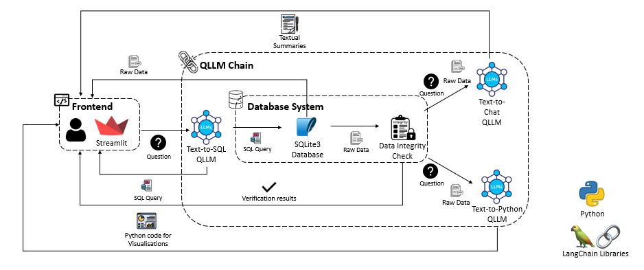
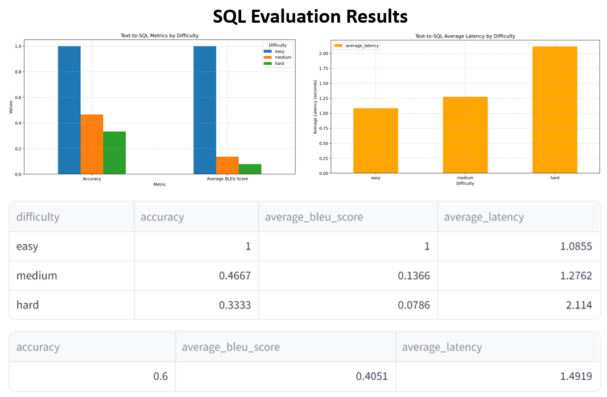
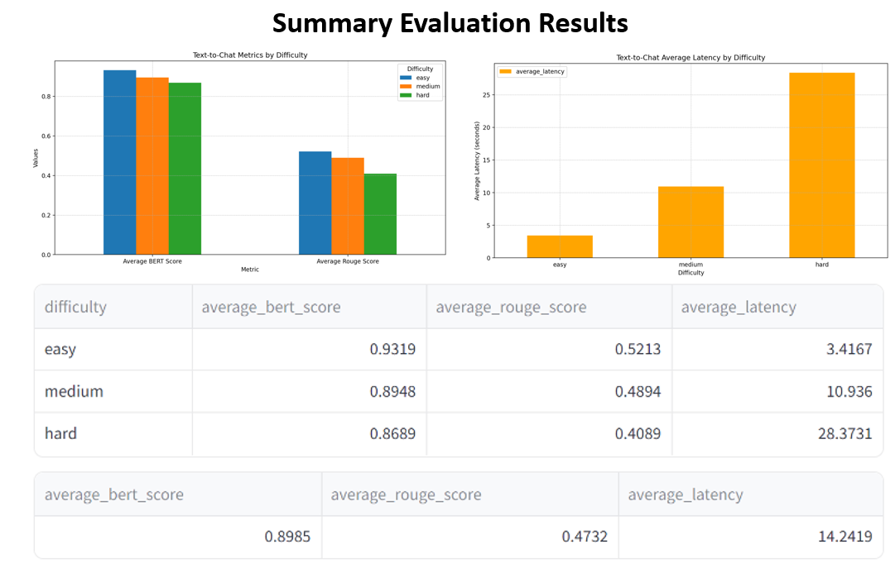
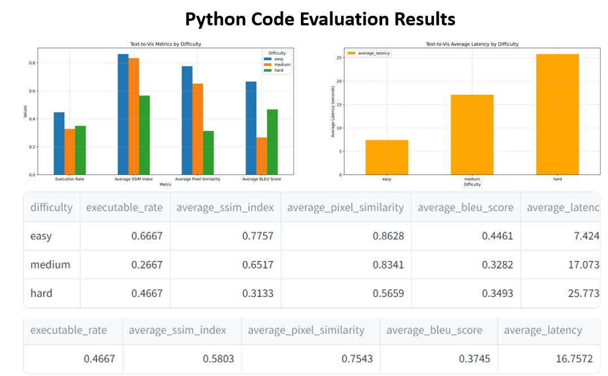
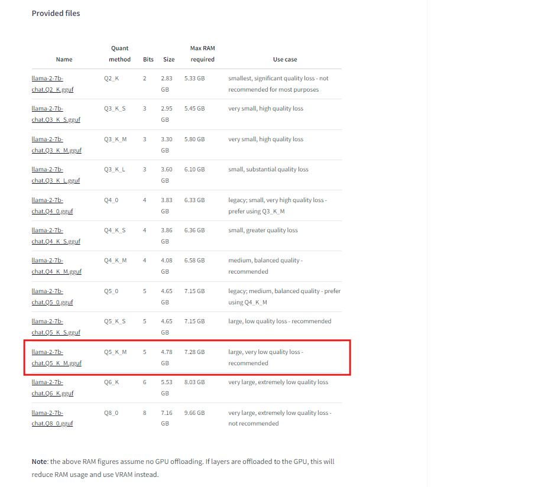

# Quantised Large Language Model Chaining

## Overview

QLLMChain is an AI Chatbot application designed to enables users to interact with data easily, regardless of their technical background. The application leverages quantised locally deployed large language models to power information retrieval and interpretation, turning natural language prompts into SQL statements, text summaries, and Python visualizations.

## System Architecture



The system consists of the following components:
- **Frontend Interface**: Streamlit-based UI for displaying outputs and allowing user interactions.
- **Database System**: SQLite3 database with synthetic data for information retrieval.
- **QLLM Chain**:
  - SQL Generator (Text-to-SQL QLLM, "NSQL-Llama-2-7B")
  - Data Summarizer (Text-to-Chat QLLM, "Llama-2-7B-Chat")
  - Data Visualizer (Text-to-Python QLLM, "CodeLlama-Python-7B")
- **Hashing Integrity Checks**: Ensuring data integrity using SHA256 hashing.

### Benchmaking Results for QLLMs

The performance of each component in the QLLMChain system was evaluated through a comprehensive benchmarking process. This involved testing the models with various queries and measuring their accuracy, latency, and other relevant metrics. A total of 45 test cases were used to evaluate each model, with three different difficulties of easy, medium and hard. 

#### Text-to-SQL Benchmarking
The `Text-to-SQL` component was benchmarked using the `nsql-llama-2-7B-GGUF` model. Key metrics measured include:
- **Accuracy**: How accurately the model converts natural language queries into SQL statements.
- **Average BLEU Score**: A measure of the quality of the generated SQL statements.
- **Average Latency**: The time taken to generate SQL queries.


#### Text-to-Chat Benchmarking
The `Text-to-Chat` component was benchmarked using the `llama-2-7B-Chat-GGUF` model. Key metrics measured include:
- **BERT Score**: Evaluates the quality of text summaries.
- **Average ROUGE Score**: Measures the overlap between the generated summaries and reference summaries.
- **Average Latency**: The time taken to generate textual summaries.


### Text-to-Python Benchmarking
The `Text-to-Python` component was benchmarked using the `CodeLlama-7B-Python-GGUF` model. Key metrics measured include:
- **Execution Rate**: The rate at which generated Python code runs successfully.
- **SSIM (Structural Similarity Index)**: Measures the similarity between generated visualizations and reference images.
- **Pixel Similarity**: The similarity in pixel values between generated and reference images.
- **Average Latency**: The time taken to generate visualizations.


## Installation
### Python Virtual Environment and Dependencies

Dependencies will be handled through Python's virtualenv. 
```
virtualenv dependencies
```
Activate the virtual environment from the Terminal
```
./dependencies/Scripts/activate
```
Download the dependencies
```
pip install -r requirements.txt
```
To deactivate the virtual environment
```
deactivate
```

### Prerequisites
- Python 3.9
- pip
- Windows (Unsure for MacOS)

Create the following local folders
* database
* model
* raw_datasets

### Downloading Necessary Models

#### Step 1: Download the Quantised Models

Download the raw GGUf files for the Text-to-SQL, Text-to-Chat, and Text-to-Python quantised models from the following links

* [Text-to-SQL](https://huggingface.co/TheBloke/nsql-llama-2-7B-GGUF) model page.
* [Text-to-Chat](https://https://huggingface.co/TheBloke/Llama-2-7B-Chat-GGUF) model page. 
* [Text-to-Python](https://https://huggingface.co/TheBloke/CodeLlama-7B-Python-GGUF) model page.

For each of these pages, locate and download the `Q5_K_M` version of the model.



Shift these models to the `model` folder for them to be used. 

#### Step 2: Run Python Setup File

This will download a base model of the Llama-2-7B-Chat-GGUF into your .cache directory for the tokenizer. It should be found under `C:\Users\XXX\.cache\huggingface\hub"`.
```
python setup.py
```
After downloading the model, change the Tokenizer filepath variable `tokenizer_fp` within `LLMConfiguration.py` to the filepath where cached model is stored. 

### Running the Application
Once these are all setup, you can run the application with
```
streamlit run app.py
```